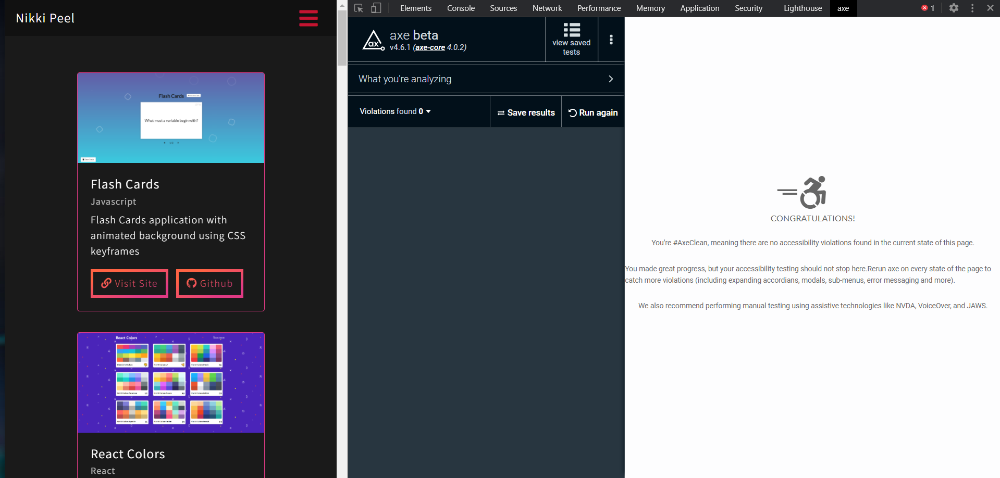
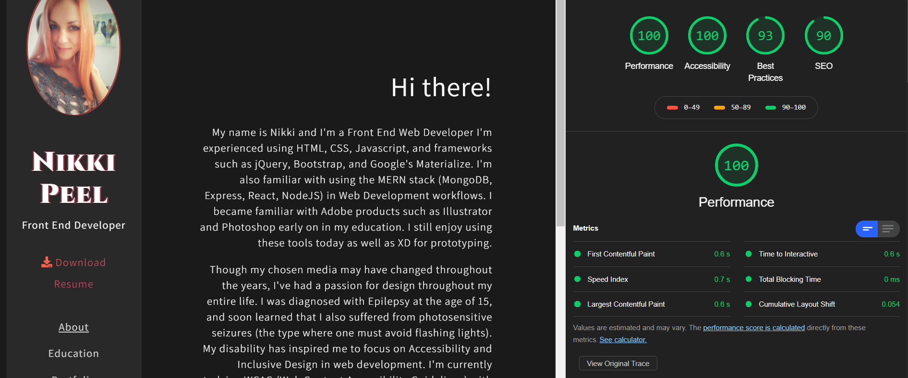

<h1>My Portfolio</h1>

*My current portfolio website built with Bootstrap 4, Navigation bars and CSS styles*

I have over 10+ years of experience as a Software Quality Assurance Analyst. I’m interested in exploring the Web Development world and creating some exciting stuff.
I’m currently enrolled in a Professional Certificate in Coding with MIT|XPRO Emeritus. I’m looking to collaborate with the Development community to learn and grow.

## Connect with Me
- My GitHub page is :  https://github.com/amohanty101
- My LinkedIn page :   https://www.linkedin.com/in/anjali-mohanty/
- You can reach me at anjali.mohanty101@gmail.com 📫

## Links to some of my MIT coding excercises
 
 Eye Exercise
<a href ="https://amohanty101.github.io/Eye-Movement-Excercise/">Eye Exercise</a>

PacMen Exercise
<a href ="https://amohanty101.github.io/PacMen-Exercise/">PacMen Exercise</a>
 
 Real Time Bus Tracker Exercise
<a href = "https://amohanty101.github.io/Real-Time-Bus-Tracker/">Real Time Bus Tracker Exercise</a> 

  

[Visit Site](https://amohanty101.github.io/portfolio-project/)
 

:gem: **Features:**
- Mobile-responsive
- Dark theme, gradient accents
- Sidebar navigation
- Card slider displaying recent projects

<!--### Axe beta Results &darr;

 

### Lighthouse Results &darr;
 -->